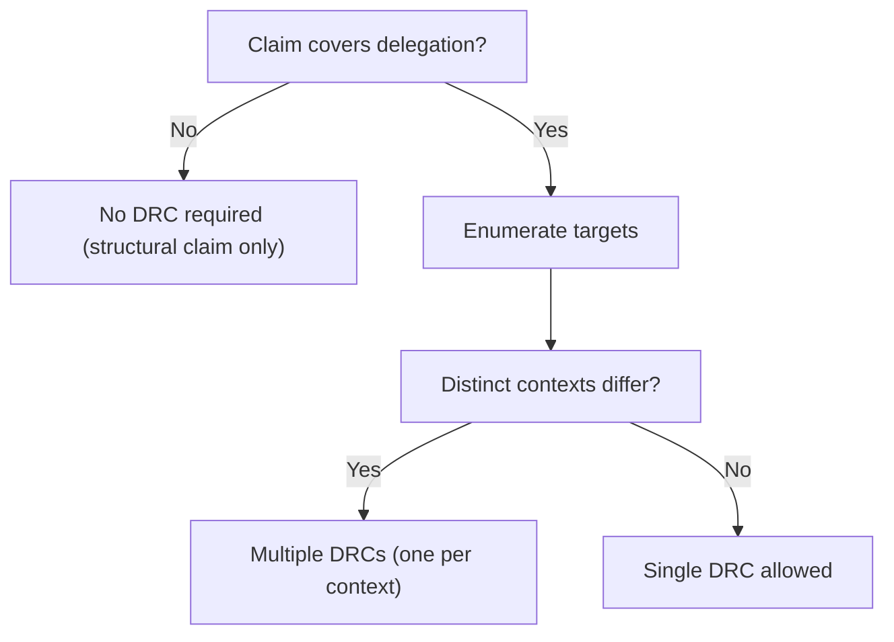

# Claim-to-DRC Mapping Guidance

## Purpose
This section defines when a single conformity claim may reference one DRC vs multiple DRCs, and how to avoid scope leakage and hidden delegation contexts.

## Normative rules
- **M1 — Targets must be enumerated:** if a claim covers more than one delegation target (agent/workflow/system/team), `delegation_targets[]` MUST list all targets.
- **M2 — One DRC per distinct delegation context:** a context is distinct if any of the following changes:

  - target changes
  - boundary anchor changes
  - decision family changes
  - risk class changes
  - authority/mandate source changes
  - intervention model changes (EIS required in one context but not another)
  - reachability constraints change (time‑to‑harm/escalation windows differ)

  If any differ, the claim MUST reference separate DRCs.

- **M3 — DRC granularity must match the narrowest permission boundary:** if a single DRC would hide differences in escalation or intervention, split it.
- **M4 — Portfolio claims allowed only as aggregation of DRCs:** a single claim may cover an entire scope portfolio only if it references all DRCs for all covered targets/decision domains and provides clear limitations/exclusions. A portfolio claim without enumerated DRC closure is invalid.

## Mapping Decision Flow (non-binding)

## Recommended patterns
**Pattern P1 — Single claim, multiple DRCs (same scope, multiple targets)**
Use when:

- same scope + same boundary anchor
- same risk class
- multiple delegation targets exist (e.g., two agents executing the same DR family)

Structure:

- `basis.drc_ids = [DRC-A, DRC-B, ...]`
- `delegation_targets[]` lists each target
- `limitations[]` states any target‑specific exclusions

**Pattern P2 — Separate claims per risk tier (avoid mixing A/B/C)**
If a scope contains both medium‑ and high‑risk decision families, issue separate claims:

- one claim for Class B contexts
- one claim for Class C contexts

This prevents accidental broad claims where short validity windows and EIS requirements get diluted.

**Pattern P3 — Separate claims per boundary anchor**
If decision execution happens across multiple SBs, prefer separate claims per SB unless:

- a multi‑boundary scope is explicitly defined with precedence/conflict resolution, and
- escalation/intervention ownership is explicitly consistent across SBs.

Otherwise: one claim per boundary.

## Anti-patterns (mapping failures)
- Single DRC covering heterogeneous targets (“DRC for the system”)
- Claim references a DRC but covers decisions outside that DRC’s context
- Mixing Class C and Class A contexts in one claim without separate DRCs and validity windows
- Claim implies permission for new targets not listed in `delegation_targets[]`
- DRC defined too broad so that EIS reachability is true for one subsystem but false for another

## Practical checklist: do you need >1 DRC?
Answer “YES” → multiple DRCs required:

- Are there multiple execution targets?
- Are there multiple SB anchors?
- Are there multiple decision families with different impact limits?
- Do time‑to‑harm windows differ?
- Does EIS apply to some but not others?
- Do authority/mandate sources differ?

If any is true: split DRCs and reference them all (or issue separate claims).
