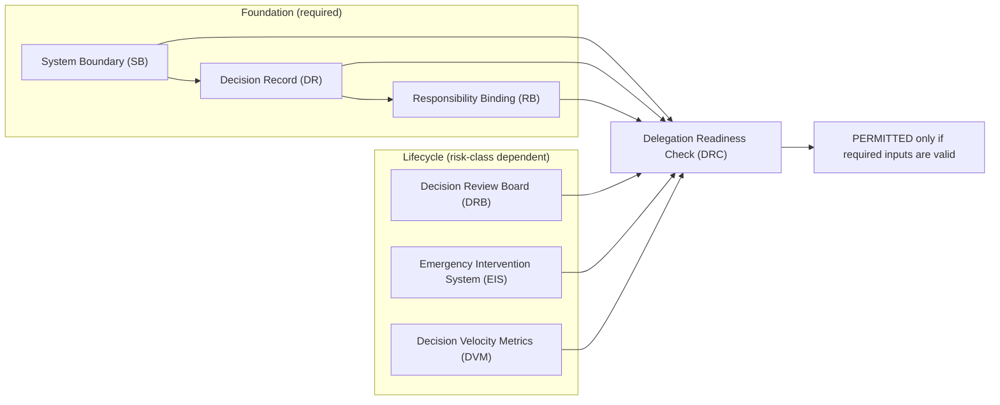

# Core Model Overview

GTAF is **artifact-centric**. An artifact is a structured state description with identity and references; artifacts **constitute normative reality**, not documentation. Delegation is valid only when the required artifacts exist, are coherent, and are within their [validity windows](/10-terminology/glossary/#validity-window).

## Delegation as responsibility transfer
Delegation transfers decision space from humans to machines, teams, providers, or workflows. **Delegation is permissible only if responsibility and decision authority are explicit, bound, and verifiable** within a defined [scope](/10-terminology/glossary/#scope).

## Model components (entity overview)
GTAF consists of:

- **Foundation artifacts**: [SB](/02-artifacts/system-boundary/), [DR](/02-artifacts/decision-record/), [RB](/02-artifacts/responsibility-binding/), [DRC](/02-artifacts/delegation-readiness-check/)
- **Lifecycle artifacts**: [DRB](/02-artifacts/decision-review-board/), [EIS](/02-artifacts/emergency-intervention-system/), [DVM](/02-artifacts/decision-velocity-metrics/)
- **Meta rules**: [validity](/10-terminology/glossary/#validity-window), [versioning](/10-terminology/glossary/#reference-version), [risk classes](/05-risk-and-criticality/risk-classes/), [scope](/01-core-model/scope-model/)

## Artifact Relationship Overview (non-binding)

> **Notes**
> - DRB/EIS/DVM are **risk‑class dependent** inputs to DRC (mandatory in B/C, conditional in A).
> - DRC is the **gate**: delegation is PERMITTED only when required inputs exist and are valid.

## Minimal formal artifact core (GTAF-conformant)
A system/domain is GTAF‑conformant within a scope only if all conditions hold:

1. **SB exists** and the decision is clearly inside the boundary.

2. **DR exists** for the delegated decision space.

3. **RB exists** and binds outcome ownership to a mandate and role.

4. **DRC = PERMITTED** is issuable based on artifacts (not belief).

5. **Temporality** is satisfied (artifacts not expired; changes reflected).

6. **Risk class requirements** are met (e.g., DRB/EIS/DVM where required).

This is a **binary, verifiable** condition, not self‑assessment.

## Structural closure (non-binding, tool-agnostic)
```text
delegation_allowed =
  exists(SB) &&
  exists(DR) &&
  exists(RB) &&
  exists(DRC) &&
  DRC.result == PERMITTED &&
  now < DRC.valid_until
```

## Interpretability constraints
- Artifacts are interpretable only relative to a [GTAF reference version](/10-terminology/glossary/#reference-version).
- Artifacts and claims are valid only within a [scope](/10-terminology/glossary/#scope) and [time window](/10-terminology/glossary/#validity-window).
- If any referenced artifact is invalid or outside scope, readiness and claims are invalid.
