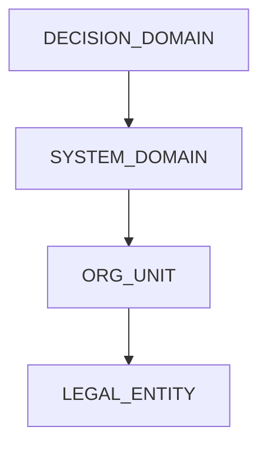

# Scope Model

Scope prevents GTAF from becoming vague. Without scope, responsibility, decision authority, and conformity collapse into unbounded claims. Every artifact and every claim must be expressible as **(Scope, GTAF Reference Version, Time Window)**.

## Purpose
This page defines:

- the **scope taxonomy** (what kinds of scopes exist),
- how scopes are **anchored** to boundaries,
- how scopes **compose** (nesting, overlap rules),
- how artifacts **bind** to scope and how scope affects validity,
- scope **invariants** and failure modes.
- how scope connects to licensing and conformity claims.

Not in scope:

- legal contract language (only structural binding)
- organization charts or tooling implementation (Azure DevOps, Jira, etc.)

## Normative principles (binding)
- **S1 — No artifact without scope**: every artifact MUST bind to exactly one scope.
- **S2 — Scope is a boundary domain**: scope must be defensible as a bounded applicability domain.
- “Entire company” is permissible only if a corresponding boundary strategy exists.
- **S3 — Scope must be boundary-anchored**: every scope MUST anchor to a [System Boundary](../02-artifacts/system-boundary/).
- **S4 — Scope governs interpretation**: the same artifact type can have different meaning in different scopes.
- **S5 — Overlap must be explicit**: overlap requires explicit precedence and responsibility resolution.

## Scope taxonomy (normative)
GTAF defines four canonical scope kinds. A deployment MAY use a subset, but must not introduce incompatible categories without explicit extension.

1. **LEGAL_ENTITY**

   - Definition: applicability equals a specific legal entity.
   - Use case: licensing and liability alignment; governance charter binding.
   - Requirements: legal entity identifier; mapping of system boundaries to legal accountability.

2. **ORG_UNIT**

   - Definition: applicability equals an organizational unit with a defined mandate.
   - Use case: internal governance delegation boundaries.
   - Requirements: explicit mandate source; role catalog coherence for ownership/escalation.

3. **SYSTEM_DOMAIN**

   - Definition: applicability is a system/platform domain.
   - Use case: architecture‑level governance boundaries; technical responsibility demarcation.
   - Requirements: anchored SB with explicit included/excluded components and interfaces; clear ownership mapping.

4. **DECISION_DOMAIN**

   - Definition: applicability is a decision family across a domain.
   - Use case: decision‑centric governance and delegation across systems.
   - Requirements: anchors to SB(s) where decisions are executed; explicit SB list if multi‑boundary.
   - Normative constraint: DECISION_DOMAIN may span multiple SBs only if multi‑boundary applicability is explicitly defined.

## Scope Precedence (non-binding)

> **Notes**
> - Precedence is used to resolve overlap (most specific scope wins).
> - If you alter precedence, it MUST be explicitly documented.

## Scope anchoring (normative)
- **Primary anchor**: `scope.boundary_ref = SB-ID`.
- **Secondary anchors** (optional): `scope.additional_boundaries = [SB-…]` when explicitly multi‑boundary.
- Multi‑boundary scopes MUST define precedence, conflict resolution, and escalation mapping across boundaries. Without these, autonomous delegation is invalid.

## Scope composition rules (normative)
- **Nesting**: child scope MUST NOT expand beyond parent boundary coverage.
- **Overlap**: allowed only with explicit precedence and deterministic resolution of applicable DR/RB.

### Precedence (recommended)

1. DECISION_DOMAIN

2. SYSTEM_DOMAIN

3. ORG_UNIT

4. LEGAL_ENTITY

If altered, the altered precedence MUST be explicitly documented.

## Scope invariants (normative)
- **SI1 — Enforceable boundary claim**: must be able to answer what is inside, what is outside, and where responsibility stops.
- **SI2 — Conformity is never global by default**: “GTAF compliant” without scope is invalid.
- **SI3 — No cross‑scope delegation without explicit linkage**.
- **SI4 — Scope changes trigger revalidation**: expand/split/merge/ownership changes require new [DRC](../02-artifacts/delegation-readiness-check/).

## Scope metadata (recommended schema fields)
- `scope.id`
- `scope.kind`
- `scope.name`
- `scope.boundary_ref`
- `scope.additional_boundaries` (optional)
- `scope.owner.role`
- `scope.mandate.source_ref` (optional)
- `scope.risk.class_default`
- `scope.precedence_rules` (if non-default)
- `scope.valid_from`, `scope.valid_until`
- `scope.change_control` (links to reference change records, if used)

## Example (non-binding, tool-agnostic)
```yaml
scope:
  id: SCOPE-REFUNDS-CIP
  kind: DECISION_DOMAIN
  name: Refund Delegation (CIP)
  boundary_ref: SB-004
  owner_role: Head of Customer Ops
  risk_class_default: A
  valid_from: 2026-01-01T00:00:00Z
  valid_until: 2026-12-31T23:59:59Z
gtaf_ref:
  version: GTAF-0.1
status: ACTIVE
revision: 1
```

## Optional patterns (explicit only)
- **P1 — Cross-scope delegation bridge**: define source scope, target scope, allowed decision families, escalation ownership resolution, validity window.
- **P2 — Decision domain spanning multiple SBs**: list SBs, define per‑SB boundary constraints, and explicit RB/escalation mapping.

## Scope and licensing (structural binding)
Scope is the natural unit for:

- conformity claims,
- license binding,
- liability demarcation.

Normative statement: a GTAF license must be expressible as **(Licensed Scope, GTAF Reference Version, License Period)**. This ensures licensing is a governance boundary, not a usage meter.

## Common failure modes (diagnostic)
- “Scope = entire organization” without a boundary strategy.
- Decision domains spanning systems with no per‑boundary mapping.
- Overlapping scopes without precedence/conflict resolution.
- Scope expansion without DRC reissuance.
- Artifacts referencing IDs outside scope validity.
