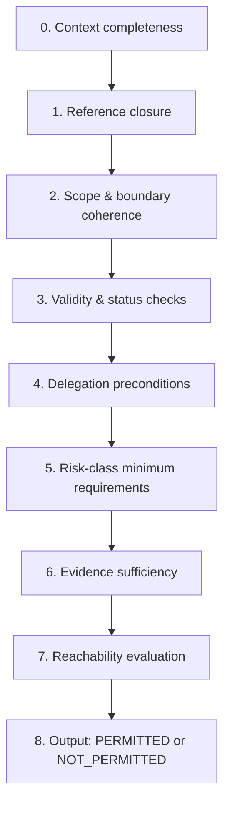

# Delegation Readiness Check (DRC)

## Purpose
This page defines the **normative evaluation semantics** for the Delegation Readiness Check (DRC). It specifies how a DRC result (PERMITTED / NOT_PERMITTED) must be derived from artifacts and evidence, without relying on informal trust or narrative.

DRC semantics are the execution logic of GTAF: they transform “we have documents” into a deterministic statement of structural permissibility within a scope and time window.

## Delegation Context (DC)
A DRC evaluates exactly one **Delegation Context**:

```text
DC = (Scope, Boundary Anchor, Target, DR-set, Risk Class, Validity Window)
```

If any element changes, a new DRC is required.

## Example (non-binding, tool-agnostic)
```yaml
drc_id: DRC-045
context:
  scope:
    id: SCOPE-REFUNDS-CIP
    kind: DECISION_DOMAIN
    boundary_ref: SB-004
  target:
    kind: AGENT
    id: SupportBot
  dr_ids: [DR-0127]
  risk_class: B
  validity_window:
    from: 2026-02-01T00:00:00Z
    until: 2026-02-28T23:59:59Z
artifact_set: [SB-004, DR-0127, RB-009]
evidence_refs: [EVID-MANDATE-01, EVID-MANDATE-02, EVID-ESC-01]
result: PERMITTED
evaluated_at: 2026-02-01T08:30:00Z
valid_from: 2026-02-01T00:00:00Z
valid_until: 2026-02-28T23:59:59Z
gtaf_ref:
  version: GTAF-0.1
status: ACTIVE
revision: 1
```

## Normative principles (binding)
- **D1 — DRC is binary and non‑negotiable**: “Almost ready” is not a state. If prerequisites are incomplete or invalid, the result MUST be NOT_PERMITTED.
- **D2 — DRC is derived, not decided**: it encodes the result of evaluating completeness, validity, and evidence.
- **D3 — DRC is context‑specific**: valid only for the defined DC tuple.
- **D4 — DRC requires closure under references**: any missing reference is a blocker.
- **D5 — Risk class defines minimum evaluation strictness**.

## Meaning of PERMITTED (normative)
A DRC result is **PERMITTED if and only if**:

1. the context is well‑defined (DC complete), and

2. all required artifacts exist, are ACTIVE, and valid in the window, and

3. risk‑class minimum requirements are satisfied, and

4. required evidence is present, accessible, current, and sufficient, and

5. escalation and intervention reachability requirements are satisfied for the context.

PERMITTED is **not** a promise of correctness of decisions. It is only permission to delegate within defined boundaries.

## Meaning of NOT_PERMITTED (normative)
A DRC result is **NOT_PERMITTED** if any of the following holds:

- missing/invalid required artifacts,
- broken referential integrity,
- insufficient boundary definition,
- missing RB where required,
- missing/expired evidence where required,
- reachability not demonstrated when required,
- unresolved conflicts that create ambiguous authority or responsibility.

## Required inputs (normative)
### A) Context inputs
- `scope.id`, `scope.kind`, `scope.boundary_ref`
- `target.kind`, `target.id`
- `risk.class` (A/B/C)
- `validity_window` (from/to)
- `dr_ids[]` included in the context

### B) Artifact inputs
- [SB](../02-artifacts/system-boundary/) (boundary anchor + referenced boundaries)
- all referenced [DR](../02-artifacts/decision-record/)(s)
- [RB](../02-artifacts/responsibility-binding/)(s) applicable to DRs (mandatory for semi/autonomous)
- [DRB](../02-artifacts/decision-review-board/), [EIS](../02-artifacts/emergency-intervention-system/), [DVM](../02-artifacts/decision-velocity-metrics/) if required by class

### C) Evidence inputs
- mandate evidence for DR authority and RB
- procedure evidence for escalation and/or EIS
- reachability evidence (drills/tests/logs) if required

## Evaluation pipeline (normative)
If any step fails, evaluation stops and result is NOT_PERMITTED with blockers.

## Evaluation Flow (non-binding)


### Step 0 - Context completeness
Validate DC tuple completeness and internal consistency.

Blockers include:

- missing scope or missing boundary anchor
- missing target definition
- missing risk class
- undefined validity window

### Step 1 - Reference closure (artifact closure)
Compute the required closure set:

- SB boundary anchor
- DR set in context
- RB set required by DR delegation level
- any artifacts referenced by the above that are required for interpretation

Rule: if any required referenced artifact does not exist → NOT_PERMITTED.

### Step 2 - Scope & boundary coherence
Verify:

- all artifacts are in the same scope (or explicitly allowed cross‑scope linkage exists)
- DR scope references the boundary anchor (directly or via defined scope model)
- SB has minimum boundary definition (included/excluded, allowed interfaces)

Blockers include:

- scope leakage (DR/RB from other scope without bridge)
- boundary not sufficiently defined
- DR references undefined or incompatible SB

### Step 3 - Validity & status checks
Verify each required artifact is:

- status = ACTIVE
- within validity window (or governed by compatible review‑cycle rules)
- not expired, not retired

Blockers include:

- artifact expired or retired
- review overdue beyond allowed tolerance for class
- artifact marked deprecated without successor where mandatory

### Step 4 - Delegation preconditions
For each DR in the set:

- validate DR contains: boundaries, excluded actions, impact limits, triggers, escalation path, expiry policy
- validate delegation level:

  - ASSISTIVE: RB optional (unless scope requires RB)
  - SEMI_AUTONOMOUS / AUTONOMOUS: RB mandatory

Blockers include:

- missing escalation path
- missing excluded actions (where needed to prevent scope leakage)
- missing RB for semi/autonomous delegation

### Step 5 - Risk-class minimum requirements
Apply minimum requirements by class:

**Class A**
- SB + DR (+ RB if semi/autonomous)
- DRC required for semi/autonomous
- evidence: mandate + escalation procedure reference (minimal)

**Class B**
- DRB required (per class rules)
- reachability evidence required for escalation (recent)
- EIS required if time‑to‑harm is short or rollback is slow (if required → must be present + evidence)

**Class C**
- DRB mandatory
- EIS mandatory + reachability evidence mandatory
- DVM mandatory baseline + thresholds
- short validity window requirements must be met

Blockers include:

- missing DRB in B/C where mandatory
- missing EIS in C
- missing DVM in C
- DRC window too long for C

### Step 6 - Evidence sufficiency
Verify evidence references:

- exist and are accessible to accountable roles
- are within their own validity/review cycle
- match the claim being made (mandate supports authority; drill supports reachability)

Blockers include:

- missing evidence
- expired evidence
- evidence not accessible / unstable reference
- evidence does not substantiate the required property

### Step 7 - Reachability evaluation (Escalation + Intervention)
**Escalation reachability** is satisfied if:

- escalation roles exist and are covered (implicitly in A, explicitly in B/C)
- activation time meets time‑to‑harm constraints
- evidence exists where required (B/C)

**Intervention reachability** is satisfied if:

- EIS activation authority is clear and mandated
- mechanism does not depend on failing subsystem
- drills/tests/logs demonstrate practical activation where required (C mandatory)

Blockers include:

- escalation depends on single unavailable person (no coverage) in B/C
- kill‑switch depends on failing system
- reachability evidence missing or failed

### Step 8 - Output construction
If no blockers exist:

- result = PERMITTED
- record evaluated artifact set, evidence set, validity window

If blockers exist:

- result = NOT_PERMITTED
- record blockers with structured taxonomy

## Blocker taxonomy (normative)
**Context & scope blockers**
- CONTEXT_INCOMPLETE
- SCOPE_UNDEFINED
- SCOPE_LEAKAGE
- BOUNDARY_ANCHOR_MISSING

**Artifact integrity blockers**
- MISSING_ARTIFACT:<id/type>
- INVALID_STATUS:<id>
- EXPIRED_ARTIFACT:<id>
- REFERENCE_NOT_CLOSED

**Governance & delegation blockers**
- MISSING_RB_FOR_DELEGATION
- DR_INCOMPLETE_BOUNDARY
- ESCALATION_UNDEFINED
- AUTHORITY_UNSUPPORTED

**Evidence blockers**
- MISSING_EVIDENCE:<id/type>
- EVIDENCE_EXPIRED:<id/type>
- EVIDENCE_NOT_ACCESSIBLE:<id>
- EVIDENCE_INSUFFICIENT:<reason>

**Reachability blockers**
- ESCALATION_NOT_REACHABLE
- EIS_NOT_REACHABLE
- EIS_DEPENDS_ON_FAILING_SYSTEM
- REACHABILITY_NOT_VERIFIED

**Risk‑class compliance blockers**
- MISSING_DRB_REQUIRED_BY_CLASS
- MISSING_EIS_REQUIRED_BY_CLASS
- MISSING_DVM_REQUIRED_BY_CLASS
- DRC_WINDOW_TOO_LONG_FOR_CLASS

## Conflict & overlap rules (normative)
- **C1 — Conflicting DR boundaries**: overlapping actions with different limits and no explicit precedence → NOT_PERMITTED. Blocker: AMBIGUOUS_AUTHORIZATION.
- **C2 — Conflicting ownership**: multiple outcome owners for the same DR without explicit resolution → NOT_PERMITTED. Blocker: AMBIGUOUS_OUTCOME_OWNERSHIP.
- **C3 — Overlapping scopes**: evaluate under most specific applicable scope per precedence rules; if undefined → NOT_PERMITTED. Blocker: SCOPE_PRECEDENCE_UNDEFINED.

## Minimal pseudocode (tool-agnostic, normative)
```text
function evaluateDRC(context):
  blockers = []

  if not context.complete():
    blockers += CONTEXT_INCOMPLETE

  closure = computeRequiredClosure(context)
  if not closure.closed():
    blockers += REFERENCE_NOT_CLOSED

  if not scopeCoherent(closure, context):
    blockers += SCOPE_LEAKAGE

  if not boundarySufficient(closure.SB):
    blockers += DR_INCOMPLETE_BOUNDARY

  if any artifact.status != ACTIVE:
    blockers += INVALID_STATUS

  if any artifact.expiredIn(context.window):
    blockers += EXPIRED_ARTIFACT

  for each DR in context.DRs:
    if not DR.hasMinFields():
      blockers += DR_INCOMPLETE_BOUNDARY
    if DR.delegation >= SEMI_AUTONOMOUS and not hasRB(DR):
      blockers += MISSING_RB_FOR_DELEGATION

  blockers += enforceRiskClassRequirements(context.class, closure)
  blockers += validateEvidenceRequirements(context.class, closure, context.window)
  blockers += validateReachability(context.class, closure, context.timeToHarm)

  if blockers.empty():
    return PERMITTED
  else:
    return NOT_PERMITTED(blockers)
```

## Output expectations (normative)
A DRC artifact instance MUST record:

- evaluated DC tuple (scope/boundary/target/DR‑set/class/window)
- closure set of artifacts used
- evidence references considered
- result (PERMITTED / NOT_PERMITTED)
- blockers (if NOT_PERMITTED)
- issuance timestamp and validity window

## Key references
- [Scope](../10-terminology/glossary/#scope)
- [Risk Class](../10-terminology/glossary/#risk-class-a-b-c)
- [Validity Window](../10-terminology/glossary/#validity-window)
- [Evidence](../10-terminology/glossary/#evidence)
- [Evidence & Reachability Rules](../03-rules/evidence-and-reachability/)
- [Reachability](../10-terminology/glossary/#reachability)
- [Decision Review Board (DRB)](../02-artifacts/decision-review-board/)
- [Emergency Intervention System (EIS)](../02-artifacts/emergency-intervention-system/)
- [Decision Velocity Metrics (DVM)](../02-artifacts/decision-velocity-metrics/)
