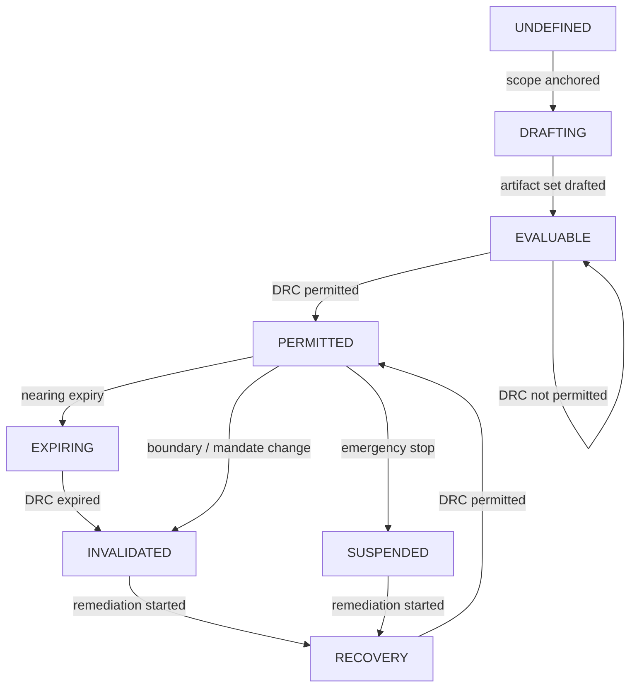

# Lifecycle State Machine (Normal → Drift → Intervention → Recovery)

## Purpose
This page defines GTAF’s **normative lifecycle semantics** as a state machine. It specifies how a delegation context moves through states over time—especially under drift, incidents, boundary changes, or mandate changes—and how it returns to a valid, claimable condition.

The lifecycle state machine prevents two common failure modes:

- **silent drift**: delegation continues while assumptions degrade
- **paper readiness**: artifacts exist, but operational reality diverges (reachability, ownership, boundaries)

## Scope
This page specifies:

- canonical states for a delegation context
- state transition triggers (events)
- required actions and artifacts per transition
- invalidation vs “review required” semantics
- incident handling path (EIS → DRB → Amend → Revalidate → Claim)
- normative rules for claim and DRC renewal

Not in scope:

- technical incident response tooling
- monitoring pipelines or alert thresholds beyond their artifact representation (DVM)
- staffing and on‑call operations beyond reachability evidence requirements

## Normative principles (binding)
- **L1 — Delegation is allowed only in a PERMITTED state**: if not PERMITTED, semi/autonomous delegation MUST NOT operate.
- **L2 — State is derived from artifacts and evidence**: determined by validity, not by optimism or intention.
- **L3 — Invalidation is deterministic**: certain trigger events MUST invalidate DRC (and therefore claims) immediately.
- **L4 — Recovery requires revalidation**: return to PERMITTED requires a new or renewed DRC (and claim if used).
- **L5 — Emergency intervention is structural**: EIS is a defined artifact and transition, not ad‑hoc operations.

## Model: Delegation Context State Machine
A Delegation Context (DC) is the evaluation unit:

```yaml
delegation_context:
  scope: <scope>
  boundary_anchor: <sb_id>
  target: <agent|system|team>
  dr_set: <dr_ids>
  risk_class: <A|B|C>
  validity_window: <from..until>
```

The state machine applies per DC.

## Simplified lifecycle view (non-binding)
```yaml
governance_state_machine:
  states: [DRAFTING, EVALUABLE, PERMITTED, EXPIRING, SUSPENDED, INVALIDATED, RECOVERY]
  rule: delegation_allowed_only_in: PERMITTED
  transitions:
    boundary_change: INVALIDATED
    mandate_change: INVALIDATED
    evidence_expired: INVALIDATED
    time_window_end: EXPIRING
    emergency_stop: SUSPENDED
```

## Canonical states (normative)
**S0 — UNDEFINED**
- DC is not sufficiently specified to evaluate readiness.
- Typical causes: missing scope/boundary anchor, missing target, undefined DR‑set.
- Delegation status: not permitted.

**S1 — DRAFTING (In Construction)**
- Artifacts are being created/edited but are not complete and/or not ACTIVE.
- Typical causes: SB/DR/RB draft or incomplete; evidence not linked; reachability not validated.
- Delegation status: not permitted.

**S2 — EVALUABLE (Closed, but not yet permitted)**
- All required artifacts exist and are closed under references, but blockers remain or DRC not issued.
- Delegation status: not permitted.

**S3 — PERMITTED (Ready for Delegation)**
- DRC is PERMITTED; required artifacts and evidence are ACTIVE and valid; reachability satisfied.
- Delegation status: permitted within defined DR boundaries only.

**S4 — EXPIRING (Time‑bound decay)**
- DC is still permitted now, but validity windows or evidence expiry is approaching.
- Delegation status: permitted until expiry; renewal required.

**S5 — SUSPENDED (Delegation halted by governance)**
- Delegation stopped because EIS activated, DRB suspended, or explicit governance suspension applied.
- Delegation status: not permitted.

**S6 — INVALIDATED (Structural invalidation)**
- DC previously permitted, but deterministic invalidation trigger occurred (expired artifacts, boundary expansion, mandate gap, failed reachability drill, conflict/ambiguity).
- Delegation status: not permitted; requires revalidation.

**S7 — RECOVERY (Revalidation in progress)**
- Artifacts amended, evidence updated, reachability re‑tested, DRB outputs executed; new DRC pending.
- Delegation status: not permitted until new PERMITTED DRC.

## Lifecycle Flow (non-binding, simplified)

> **Legend**
> - Main path: UNDEFINED → DRAFTING → EVALUABLE → PERMITTED
> - Exception paths: EXPIRING / INVALIDATED / SUSPENDED → RECOVERY

## State transition events (normative)
Events are grouped into categories. Each event has: Trigger, Transition, Required actions, Minimum artifacts affected.

### Category A - Construction / Definition Events
**E-A1: Scope defined (Scope record created and boundary anchored)**
- Transition: UNDEFINED → DRAFTING
- Required actions: establish scope.id/kind, SB anchor

**E-A2: Artifact set created (SB/DR/RB drafted)**
- Transition: DRAFTING → EVALUABLE (only if closure exists)
- Required actions: reference closure; fill required fields; set ACTIVE where appropriate

### Category B - Readiness Evaluation Events
**E-B1: DRC issued (PERMITTED)**
- If blockers empty: EVALUABLE → PERMITTED
- Required actions: record closure set, evidence set, result

**E-B2: DRC issued (NOT_PERMITTED)**
- If blockers exist: remain EVALUABLE (NOT_PERMITTED)
- Required actions: record blockers; remediation plan

**E-B3: Claim issued (optional but typical)**
- Does not change DRC state; produces claim overlay.
- Recommended mapping:

  - PERMITTED + valid claim → “claimable”
  - PERMITTED without claim → “permitted but not declared”

### Category C - Time / Validity Events
**E-C1: Approaching expiry (DRC/claim/evidence nearing valid_until)**
- Transition: PERMITTED → EXPIRING
- Required actions: schedule renewal; DRB review (B/C) if applicable

**E-C2: DRC expired**
- Transition: PERMITTED | EXPIRING → INVALIDATED
- Required actions: stop delegation (if semi/autonomous); initiate RECOVERY path; reissue DRC

**E-C3: Claim expired**
- Transition: none (DC may remain PERMITTED)
- Required actions: renew claim if used

**E-C4: Evidence expired**
- Transition: PERMITTED | EXPIRING → INVALIDATED
- Required actions: renew evidence; re-verify reachability (B/C); reissue DRC if required

### Category D - Change Events (deterministic invalidation triggers)
These events MUST invalidate the DC if the context includes semi/autonomous delegation.

**E-D1: Boundary expansion (SB change)**
- Transition: PERMITTED | EXPIRING → INVALIDATED
- Required actions: update SB; reassess risk class; reissue DRC

**E-D2: Interface widened (SB change)**
- Transition: PERMITTED | EXPIRING → INVALIDATED
- Required actions: update SB; verify enforcement expectations; reissue DRC

**E-D3: DR boundary or impact limit change**
- Transition: PERMITTED | EXPIRING → INVALIDATED
- Required actions: amend DR; check RB; reissue DRC

**E-D4: Delegation level change (assistive → semi/autonomous or broader autonomy)**
- Transition: PERMITTED | EXPIRING → INVALIDATED
- Required actions: reclassify risk; ensure RB/DRB/EIS/DVM requirements; reissue DRC

**E-D5: Mandate change / authority change (DA/IA/OO/EO roles)**
- Transition: PERMITTED | EXPIRING → INVALIDATED (or SUSPENDED if immediate stop)
- Required actions: update RB/DR; confirm mandate continuity; reissue DRC

**E-D6: Scope change (split/merge/overlap resolution changed)**
- Transition: PERMITTED | EXPIRING → INVALIDATED
- Required actions: update scope model; resolve precedence; reissue DRC(s)

**E-D7: Conflict introduced (ambiguity)**
- Transition: PERMITTED | EXPIRING → INVALIDATED
- Required actions: resolve conflict; define precedence; reissue DRC

### Category E - Drift & Incident Events
**E-E1: Drift suspected (DVM threshold breach / DRB signal)**
- Transition: PERMITTED → SUSPENDED or PERMITTED → INVALIDATED depending on severity and class
- Required actions: DRB review; decide amend/suspend/EIS; if severe, activate EIS
- Normative default:

  - Class B: can go to SUSPENDED while review executes
  - Class C: prefer immediate SUSPENDED, often with EIS, until revalidated

**E-E2: Incident requiring immediate stop**
- Transition: PERMITTED | EXPIRING → SUSPENDED (via EIS activation)
- Required actions: EIS activation record; DRB convened (B/C mandatory); begin RECOVERY

**E-E3: Reachability drill failed (B/C)**
- Transition: PERMITTED | EXPIRING → INVALIDATED (or SUSPENDED if immediate stop required)
- Required actions: fix reachability mechanism or coverage; re‑test; reissue DRC

**E-E4: Real activation occurred**
- Transition: PERMITTED | EXPIRING → SUSPENDED
- Required actions: DRB review; tighten boundaries if needed; reissue DRC before re-enable

## Minimal transition table (quick reference)
Table T‑02 — Transition Table

| From | Event | To | Delegation |
| --- | --- | --- | --- |
| UNDEFINED | scope anchored | DRAFTING | NO |
| DRAFTING | closure achieved | EVALUABLE | NO |
| EVALUABLE | DRC PERMITTED | PERMITTED | YES |
| PERMITTED | nearing expiry | EXPIRING | YES (until expiry) |
| PERMITTED / EXPIRING | expiry | INVALIDATED | NO |
| PERMITTED / EXPIRING | boundary/mandate/DR change | INVALIDATED | NO |
| PERMITTED | drift suspected | SUSPENDED / INVALIDATED | NO |
| PERMITTED / EXPIRING | EIS activation | SUSPENDED | NO |
| SUSPENDED / INVALIDATED | remediation started | RECOVERY | NO |
| RECOVERY | DRC PERMITTED | PERMITTED | YES |

## Recovery path (normative)
**Standard recovery sequence**

1. Stop delegation (if not already stopped) via governance suspension or EIS.

2. DRB review (B/C mandatory): classify issue (boundary drift, authority gap, evidence gap, behavior drift).

3. Amend artifacts (SB/DR/RB updated; limitations tightened; mandates updated).

4. Restore reachability (update procedures/coverage; run drill/test if required).

5. Reissue DRC (must evaluate to PERMITTED).

6. Reissue claim (if used) with new validity window and new DRC basis.

**Return condition:** only a PERMITTED DRC returns the DC to PERMITTED state.

## Invalidation vs “review required” (normative distinction)
**Deterministic invalidation (must stop):**
- expired DRC or claim validity
- missing/invalid RB for semi/autonomous
- SB boundary expansion or interface widening
- mandate/ownership gap for outcome owner or intervention authority
- missing/expired reachability evidence in B/C
- ambiguity conflicts (authorization/ownership precedence undefined)

**Review required (may remain permitted until review, if still valid):**
- approaching expiry (EXPIRING)
- minor non‑breaking reference changes without semantic impact

For Class C, tolerance for “remain permitted during review” should be minimal.

## Claim coupling (normative)
Claims are overlays and inherit validity from the underlying DC state:

- If DC becomes INVALIDATED or SUSPENDED → the claim becomes invalid for operational use.
- Claims must be renewed after recovery alongside DRC renewal.

See: [Evidence & Reachability Rules](../03-rules/evidence-and-reachability.md).

## Guardrails (anti-patterns)
- Continuing delegation in EXPIRING/INVALIDATED because “nothing happened yet”.
- Treating EIS as optional in Class C.
- Renewing claims without reissuing DRC.
- Amending DR boundaries without invalidating and revalidating.
- Allowing a period where RB has no valid outcome owner while delegation remains active.
