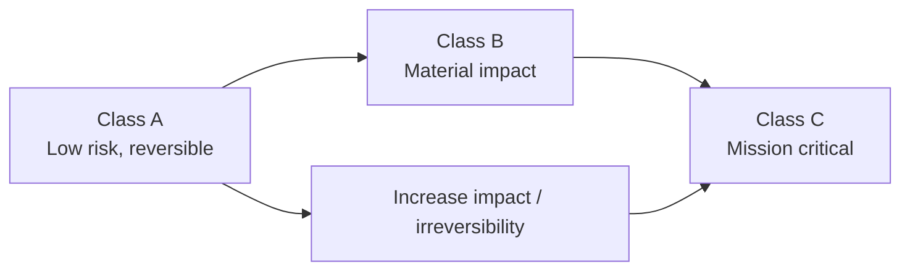

# Risk & Criticality Classes

## Purpose
This page defines the normative risk and criticality classification used by GTAF to determine the minimum structural requirements for delegation and operation. Risk classes do not change what GTAF is; they define **how strict** GTAF must be applied in a given scope.

Risk classes are a **governance instrument**, not a maturity model and not a scoring system. Their function is to make the statement “this is safe enough to delegate” structurally precise.

## Scope
This section specifies:

- the class definitions (A/B/C)
- classification criteria (how to assign a class)
- minimum artifact requirements per class (what must exist, and how strict validity must be)
- review cadence and validity windows per class
- upgrade/downgrade rules (when classification must change)

Not in scope:

- certification, labeling, or external auditing formats
- technical implementation details for enforcement or monitoring

## Normative principles (binding)
- **RP1 — Minimum rigor**: risk class sets the floor, not the ceiling.
- **RP2 — Impact over effort**: risk is defined by impact and irreversibility, not by how hard something is to build.
- **RP3 — Autonomy amplifies risk**: higher [delegation level](/10-terminology/glossary/#delegation-level) requires re‑evaluation.
- **RP4 — Scope‑bound**: risk class is assigned per [scope](/10-terminology/glossary/#scope), not globally.
- **RP5 — When uncertain, classify higher**.

## Class definitions (normative)
### Class A - Low Risk
Bounded impact, reversible, low external exposure.

Typical characteristics:

- limited financial impact,
- no regulated or highly sensitive data,
- no safety‑critical outcomes,
- bounded blast radius,
- rollback feasible and fast.

Illustrative examples:

- internal workflow automation with no external effect,
- low‑impact assistive communication suggestions,
- refunds below a strict, small threshold with easy reversal.

### Class B - Medium Risk
Material impact or moderate external exposure.

Typical characteristics:

- meaningful (but bounded) financial impact,
- regulated data in limited/controlled form,
- operational continuity impact possible but not catastrophic,
- rollback possible but costly/slow,
- broader blast radius, multi‑team dependencies.

Illustrative examples:

- bounded credit‑limit adjustments,
- automated account restrictions under strict criteria,
- routing decisions affecting production performance.

### Class C - High / Mission Critical
Irreversible or severe impact; safety, rights, regulated infrastructure, or systemic business continuity.

Typical characteristics:

- high or unbounded financial exposure,
- safety‑critical or rights‑affecting outcomes,
- highly regulated environments,
- large blast radius and systemic risk,
- rollback impossible or too slow to prevent harm.

Illustrative examples:

- credit approvals / loan issuance,
- access to core banking or payment rails,
- medical/safety decisions,
- automated sanctions, terminations, or legally binding actions.

## Risk Class Ladder (non-binding)

## Upgrade / downgrade rules (normative)
### Upgrade triggers (must reclassify upward)
- delegation level increases (assistive → semi/autonomous),
- impact limits are raised (money, user count, data class),
- new regulated data enters the boundary,
- time‑to‑harm decreases,
- rollback becomes slower or less complete,
- integration expands blast radius (coupling increases).

### Downgrade conditions (rare, requires evidence)
Downgrade is permissible only if:

- impact limits are demonstrably reduced,
- reversibility is improved (fast, proven rollback),
- boundary is narrowed and enforceable,
- regulatory exposure is removed,
- a [DRB](/02-artifacts/decision-review-board/) explicitly approves the downgrade and a new [DRC](/02-artifacts/delegation-readiness-check/) is issued.

## Practical classification procedure

1. Determine scope and anchor to [SB](/02-artifacts/system-boundary/).

2. Enumerate decision spaces (DR candidates) and delegation levels.

3. Assess criteria C1–C7; if uncertain → classify higher.

4. Declare class per scope and record in scope metadata.

5. Apply minimum requirements (artifacts + cadence + validity windows).

6. Issue DRC only once minimum requirements are satisfied.

## Guardrails
- Risk classes are not product tiers, pricing tiers, or maturity scores.
- Risk classes must not become a negotiation tool to weaken requirements.
- “We are a startup” is not a reason to downgrade.
