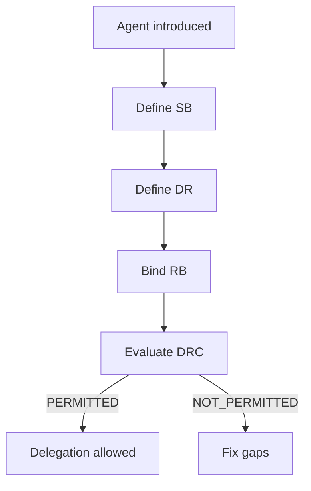

# Autonomous Agent (Generic)

## Why this matters now
Agentic systems are being deployed across low‑ and high‑risk domains. They can act without immediate human approval, which makes **delegation, accountability, and intervention** the core safety problems.

GTAF is designed to make those problems explicit and verifiable without prescribing tools.

## What GTAF does for agentic systems
- **Defines the boundary** where the agent is allowed to act (SB).
- **Defines the decision space** and its limits (DR).
- **Binds outcome ownership** to a human/organizational role (RB).
- **Gates activation** with a binary readiness check (DRC).
- **Scales strictness** by risk class (A/B/C).

## Minimal adoption (low‑risk agent)
If you deploy an agent in a bounded, reversible domain (Class A):

1. Create SB (what is in/out).
2. Define DR (what the agent may decide).
3. Bind RB (who owns outcomes).
4. Issue DRC (PERMITTED or NOT_PERMITTED).

This is enough to make delegation explicit and auditable, without heavy governance.

## When risk increases (Class B/C)
As impact, irreversibility, or autonomy increases:

- **DRB** becomes mandatory (drift review).
- **EIS** becomes mandatory (intervention/kill‑switch).
- **DVM** becomes mandatory (early warning signals).

## Agentic Delegation Flow (non-binding)

> **Notes**
> - The same structure applies across low‑ and high‑risk agents; only strictness changes.
> - If any required artifact is invalid, delegation is NOT_PERMITTED.

## Start here
- [Minimal Application Path](/06-application/minimal-application-path/)
- [Risk Classes](/05-risk-and-criticality/risk-classes/)
- [System Boundary (SB)](/02-artifacts/system-boundary/)
- [Decision Record (DR)](/02-artifacts/decision-record/)
- [Responsibility Binding (RB)](/02-artifacts/responsibility-binding/)
- [Delegation Readiness Check (DRC)](/02-artifacts/delegation-readiness-check/)
